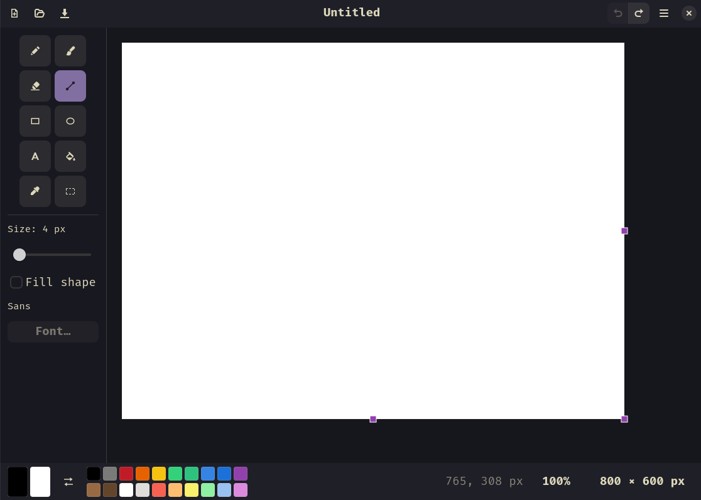

# Hue

A straightforward raster paint application for Fedora / GNOME, in the spirit of the
classic Windows Paint. Built with GTK4 and libadwaita, it follows the system light/dark
preference and accent colour automatically, and works entirely offline.



## Requirements

Fedora Workstation 40 or newer:

```
sudo dnf install python3-gobject python3-cairo gtk4 libadwaita
```

To build and install, also: `sudo dnf install meson ninja-build`

## Running from source

No build step is needed for development:

```
python3 -m hue
```

Optionally pass an image to open: `python3 -m hue picture.png`

## Running the tests

The pytest suite covers the drawing, file, clipboard, selection, text and undo logic,
and checks that every module and icon the app uses gets installed. It needs no display.

```
sudo dnf install python3-pytest
python3 -m pytest
```

From a meson build directory, `meson test -C builddir` runs the same suite.

## Installing

```
meson setup builddir --prefix=/usr/local
meson install -C builddir
```

This installs the `hue` launcher, the desktop entry, the app icon and the app data
(stylesheet plus tool icons). The launcher points at the installed data directory;
`HUE_DATA_DIR` overrides it if you need to.

## Flatpak

`flatpak/io.github.rafael0rueda.Hue.json` builds against `org.gnome.Platform` 50. It needs
`flatpak-builder` and the GNOME SDK, which are not installed by default:

```bash
sudo dnf install flatpak-builder
flatpak install flathub org.gnome.Sdk//50 org.gnome.Platform//50
flatpak-builder --user --install --force-clean build flatpak/io.github.rafael0rueda.Hue.json
```

The manifest deliberately grants no network permission — the app has no reason to
reach the network, and the sandbox enforces that. It grants no filesystem access
either: Hue only sees the images you pick in the Open and Save dialogs, drop onto the
canvas or copy from Files, all of which reach it through the desktop's file portal.

## Tools and shortcuts

| Tool          | Key | Notes                                                                |
| ------------- | --- | -------------------------------------------------------------------- |
| Pencil        | `P` | Hard-edged, no antialiasing                                          |
| Brush         | `B` | Soft round stroke                                                    |
| Eraser        | `E` | Paints the secondary (background) colour                             |
| Line          | `L` | `Shift` snaps it to 45° steps                                        |
| Rectangle     | `R` | "Fill shape" fills with the secondary colour; `Shift` draws a square |
| Ellipse       | `O` | `Shift` draws a circle                                               |
| Text          | `T` | Type onto the canvas in any installed font                           |
| Fill          | `F` | Flood fill with a small colour tolerance                             |
| Colour picker | `K` | Picks the colour under the cursor                                    |
| Select        | `S` | Rectangle to move, copy or cut                                       |

Left click draws with the primary colour, right click with the secondary one. Both
colour swatches in the bottom bar work the same way: left click sets the primary
colour, right click the secondary. `X` swaps them.

| Action                      | Shortcut                                         |
| --------------------------- | ------------------------------------------------ |
| New / Open / Save / Save As | `Ctrl+N` / `Ctrl+O` / `Ctrl+S` / `Ctrl+Shift+S`  |
| Canvas size                 | `Ctrl+E`                                         |
| Select all                  | `Ctrl+A`                                         |
| Cut / Copy / Paste          | `Ctrl+X` / `Ctrl+C` / `Ctrl+V`                   |
| Nudge a selection or paste  | Arrow keys (`Shift` for 10 px)                   |
| Land / discard a paste      | `Enter` / `Esc`                                  |
| Drop / clear a selection    | `Esc` / `Delete`                                 |
| Land / discard typed text   | `Ctrl+Enter` / `Esc`                             |
| Undo / Redo                 | `Ctrl+Z` / `Ctrl+Shift+Z` (or `Ctrl+Y`)          |
| Zoom in / out / 100%        | `Ctrl++` / `Ctrl+-` / `Ctrl+0`, or `Ctrl`+scroll |
| Quit                        | `Ctrl+Q`                                         |

## Opening and saving

Images open in any format GdkPixbuf reads (PNG, JPEG, BMP, TIFF, WebP…), up to 8192 ×
8192 pixels; a larger image is refused with a message rather than loaded. **Recent
Files** in the main menu lists the last eight images you opened or saved; one that can
no longer be opened is taken off the list when you pick it.

Saving uses the format matching the file extension. A name typed without one gets
`.png` added — Hue asks first if that would replace an existing file — and saving as
JPEG asks for a quality from 1 to 100, remembering your last choice while the window is
open. The image is
written in full before it replaces the old file, so a save that fails, on a full disk
say, leaves the original untouched. BMP and JPEG have no transparency, so transparent
areas are saved as white; ICO files are limited to 256 × 256 pixels.

The title shows `•` while there are unsaved changes, and undoing back to the image as
it was last saved clears it again. Undo keeps up to 50 steps, fewer for very large
images, since each step is a full copy of the picture: a 4000 × 3000 photo keeps around
twenty.

## Zooming

`Ctrl`+scroll zooms around the pointer, so whatever is under it stays put; `Ctrl++` and
`Ctrl+-` step through the usual levels between 10% and 800%, and `Ctrl+0` — or clicking
the zoom level in the bottom bar — goes back to 100%. The same three are in the main
menu. Every tool keeps working at any zoom, and from 100% up each image pixel shows as
a crisp square, which makes pixel-level touch-ups with the pencil easy. The bottom bar
also shows which image pixel the pointer is over.

## Resizing the canvas

Drag one of the three grips on the right, bottom and bottom-right edge of the image to
resize it by hand; the dashed outline and the size readout in the bottom bar follow the
pointer, and the change is applied when you let go. For an exact size, click that
readout or use **Canvas Size…** (`Ctrl+E`) in the main menu. Either way the image keeps
its top-left corner — growing the canvas adds white, shrinking it crops — and the
resize can be undone with `Ctrl+Z`.

While the select tool has a selection, its own eight handles take the place of these
grips; press `Esc` to drop the selection and get them back.

## Pasting images

`Ctrl+V` drops whatever image is on the clipboard — a screenshot, most usefully — onto
the canvas, where it floats inside a dashed outline until you decide where it goes.
Drag it into place, then press `Enter` or click anywhere outside it to stamp it down;
`Esc` or `Ctrl+Z` throws it away instead. Dragging an image file or an image from
another application onto the canvas does the same thing, and an image copied as a file
in Files pastes just as well as one copied as pixels.

If the pasted image runs off the right or bottom edge — a full-screen screenshot on a
smaller canvas usually does — the canvas grows to fit it when the paste lands, so
nothing is cropped. The size readout in the bottom bar counts out the size you are
heading for while the paste is still floating, and one `Ctrl+Z` afterwards takes back
both the pixels and the new canvas size.

`Ctrl+C` copies the whole canvas the other way, so it can be pasted into other
applications.

## Selecting, moving and copying

Pick the select tool (`S`) and drag a rectangle over the part of the image you want; a
dashed outline marks it out. Dragging from inside that outline lifts those pixels and
carries them somewhere else — hold `Ctrl` as you start the drag to leave a copy behind
instead of moving them. The pixels float exactly like a paste does, so `Enter` or a
click outside lands them, `Esc` or `Ctrl+Z` puts them back, and moving them past the
right or bottom edge grows the canvas. A move leaves white behind — the colour the
canvas is made of, not whichever colour you happen to be painting with — and the whole
move, the gap and the pixels in their new place, is a single `Ctrl+Z`.

Because a drag that starts inside the rectangle moves it, press `Esc` first when what
you want is to select a different area that overlaps the current one.

With the select tool in hand, a selection has eight handles around it. Dragging one
stretches or squashes the selected pixels, again with `Ctrl` to leave the original in
place; the stretch keeps hard edges hard rather than blurring them. A floating paste
has the same handles, so a screenshot can be scaled down before it lands. The arrow
keys nudge a selection or a paste by one pixel, or ten with `Shift`, lifting the
selection the first time the same way a drag would.

`Ctrl+A` selects the whole image and switches to the select tool, and **Crop to
Selection** in the main menu cuts the canvas down to just the selected rectangle.

The selection outlives the tool that made it: `Ctrl+C` copies just that rectangle
rather than the whole canvas, `Ctrl+X` cuts it out and `Delete` clears it to white
without touching the clipboard, whichever tool is in hand. Only the select tool picks
the pixels up, though — with a brush selected you paint over them as usual. `Esc`, or
a click outside the rectangle while the select tool is in hand, drops the selection.

## Rotating and flipping

The main menu turns the whole image a quarter turn either way — swapping its width and
height — or mirrors it left to right or top to bottom. A paste or text still floating
is landed first and any selection is dropped; each is a single step to undo.

## Adding text

Pick the text tool (`T`) and click where the text should start: a dashed box appears
with a caret in it, and what you type is drawn straight onto the canvas in the primary
colour — right-click instead to type in the secondary one. The sidebar slider that
sizes the brush sizes the text instead while the text tool is selected, in points, and
**Font…** below it picks the family and style. Both apply to the box you are typing in
as well as the next one, so you can resize the text you are looking at.

The text stays editable until it lands. `Enter` starts a new line, the arrow keys,
`Home`, `End`, `Backspace` and `Delete` work as usual, and clicking inside the box puts
the caret where you clicked. Dragging the box moves it. Nothing is written into the
image until you press `Ctrl+Enter`, click outside the box, or switch to another tool;
`Esc` or `Ctrl+Z` throws it away instead.

Once it lands the text is pixels like everything else — there is no going back to
editing it, only `Ctrl+Z`. Text that runs off the right or bottom edge grows the canvas
the same way a paste does. Because the image should look the same everywhere, the text
is laid out at 96 dpi regardless of the desktop's text scaling, so a size of 24 always
gives the same pixels.

## Theming

libadwaita does the work: the app follows the system colour scheme and accent colour
with no configuration. The only custom styling lives in `data/style.css`, written
against libadwaita's named colours (`@accent_bg_color`, `@sidebar_bg_color`, …) rather
than fixed values, so re-theming the app means editing that one file. Tool icons are
symbolic SVGs in `data/icons/`, so they recolour with the theme too.

## Licence

Hue is free software under the GNU General Public License, version 3 or later; the
full text is in [LICENSE](LICENSE). Source and data files carry `SPDX-License-Identifier`
headers. The AppStream metainfo file is CC0-1.0, as AppStream requires of metadata.
